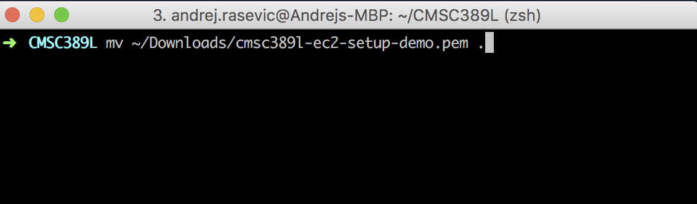
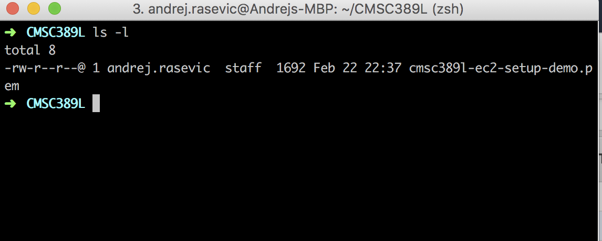
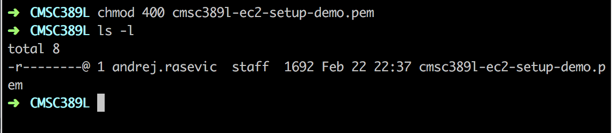
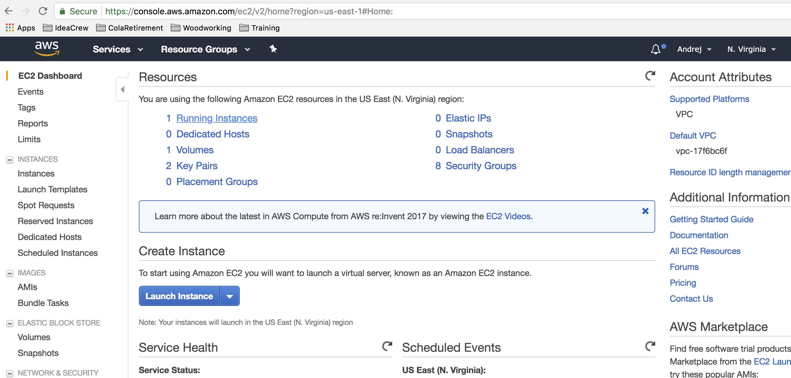
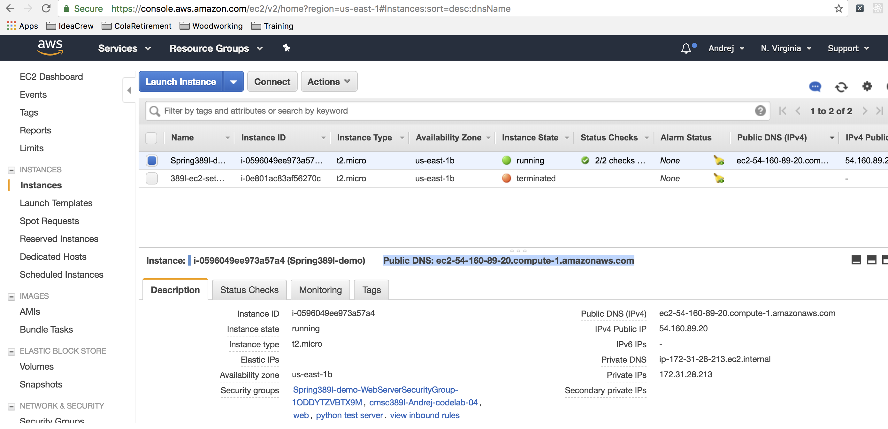
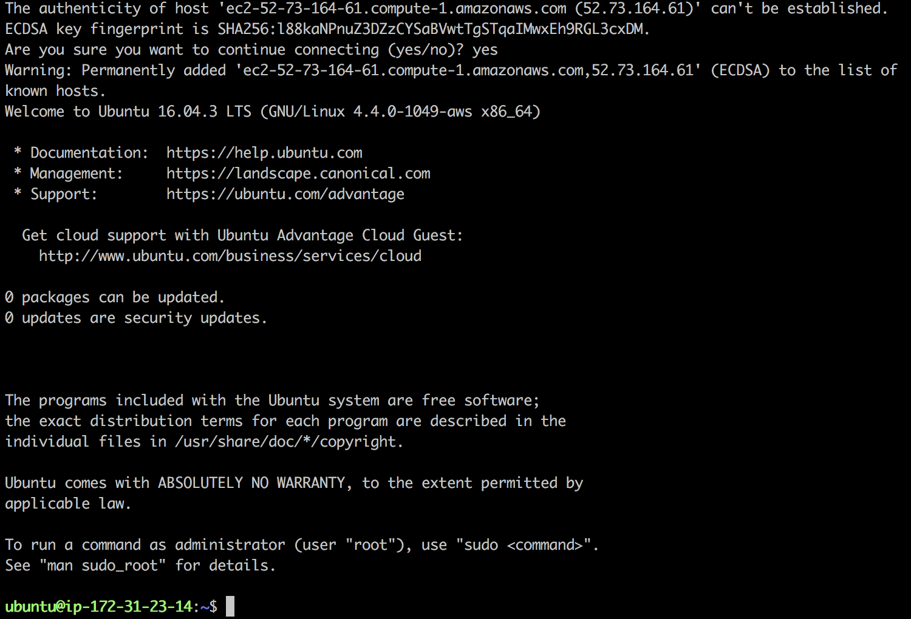

For the sake of this tutorial, we are assuming that you already have configured your
EC2 instance, it is up and running and you know where you downloaded the SSH key
Amazon generated for you when you first set up your server. If all of these things
are not done, feel free to go back to the [Setting up EC2 instance tutorial](./README.md) to
take care of any missing details.

This tutorial will take place using the command line. Regardless of which OS you are running
locally, open up a terminal session. Inside your home directory create a directory that you will
be using for this class. For this tutorial I created CMSC389L.

Next navigate inside the directory you just created. Now you will need to move the key
you downloaded from Amazon in the previous tutorial. It should be inside of your Downloads
directory inside of your home directory.

Type `ls -l` inside your terminal.

Remember the permissions you learned about in 216 and
what they referred to? If you don't, click [here](https://chmod-calculator.com/). When you
first download the key it is set that the owner can read and write to the key, and anyone
else on your machine can read it. If you try to connect to your EC2 instance with your key like
like this you will be denied because of security reasons. You need to make your key more secure by
executing the following command: `chmod 400 your-key-name.pem`. After running this command
and then `ls -l` again you should see this:

Now you're ready to connect to your EC2 instance via SSH!

The final step is to execute the following command:
`ssh -i "your-ssh-key.pem" ubuntu@your-public-dns.compute-1.amazonaws.com`

A few things to be aware of. You must be in the same directory as the location of your pem key
for this command to work or else you will need to pass the full path of its location on your
system. Also, the default user login for Ubuntu images on Amazon is ubuntu. If you didn't note
your server's public ip, you can log in to the AWS console, click on EC2 under the services menu as you
did when you first created your server, and then Running Instances (your server must be running or you won't
have anything to connect to).

Click on the server you want to get information about (you should only have one at this point)
and you should see the public DNS in the middle.

This is the public ip you need to use to connect directly to your machine via SSH or later to
enter in the browser to see a web page you host. Now once you enter the ssh command, you will
be prompted (only this time since you are connecting for the very first time from your local
machine) if you are sure you want to connect. Enter `yes` and you should see the following:

### Congratulations!

You've now successfully connected to your EC2 server for the first time. To logout of your
server, simply type `exit` and you will be back on your local machine.

Next up - installing and running your own web server on your EC2 server.

