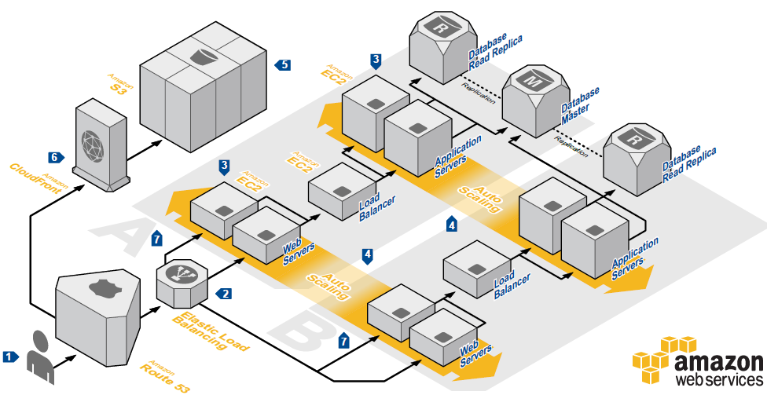

# CMSC389L: Practical Cloud Computing with AWS

## Course Description

This course provides a practical and programming-oriented introduction to cloud computing with [Amazon Web Services](https://aws.amazon.com/about-aws/) (AWS). Students will learn how to build applications using a variety of AWS services, including S3, EC2, Lambda, and ECS. The course will culminate in a final resume-worthy project that will be built, deployed, and demoed.

[Check out the final projects](https://umd-cs-stics.gitbooks.io/cmsc389l-fall2017/content/vagrant/final-project/projects.html) that came out of this class last semester!

## Course Goals

There are two primary goals of this class:

- To help you become comfortable using and interconnecting AWS services.
- To help you build a project from scratch on AWS, which can be demoed to prospective employers.

A secondary goal of this class is to introduce you to scalable design patterns that can be used to design more efficient systems.

By the end of the semester, the above diagram should make sense to you and you will have all of the necessary skills to be able to replicate it!

## Course Details

- **Course**: CMSC389L
- **Links**: [[Testudo](http://ter.ps/ttdo389ls18)] [[GitHub](https://github.com/UMD-CS-STICs/389Lspring18)] [[GitBook](http://ter.ps/pccS18)] [[Piazza](http://piazza.com/umd/fall2017/cmsc389l)]
- **Prerequisites**: C- or better in **CMSC330** and CMSC250
- **Credits**: 1
- **Seats**: 30
- **Lecture Time**: Fridays, 3-3:50PM
- **Location**: CSI 3118
- **Semester**: Spring 2018
- **Textbook**: None
- **Course Facilitators**: [Colin King](https://www.linkedin.com/in/colinking1/), [Andrej Rasevic](https://www.linkedin.com/in/andrej-rasevic-b80b3899/), [Isaac Lockwood](https://www.linkedin.com/in/isaac-lockwood-164515114/)
- **Faculty Advisor**: [Neil Spring](http://www.cs.umd.edu/~nspring/)

## Schedule

Here is the tentative schedule for this semester. Learn more about these services in [plain English](https://www.expeditedssl.com/aws-in-plain-english) or from [AWS](https://www.amazonaws.cn/en/products/).

Keep in mind that once the final project is released, the length of the codelabs will decrease.

| Week       | Topic                                    | Codelab    |
| ---------- | ---------------------------------------- | ---------- |
| 1/26/2018  |	Introduction and AWS 101				| [Codelab 1: Python](codelabs/codelab-01)  |
| 2/2/2018   |	Object Storage: S3 						| [Codelab 2: S3](codelabs/codelab-02) |
| 2/9/2018   |	Content Delivery Networks: CloudFront 	| [Codelab 3: S3 + CloudFront](codelabs/codelab-03) |
| 2/16/2018  |  Compute 1: EC2							| Codelab 4: EC2  |
| 2/23/2018  |	Compute 2: EC2							|            |
| 3/2/2018   | 	Now You're Thinking with Queues: SQS	| Codelab 5: EC2 + SQS  |
| 3/9/2018   |	Load Balancers: ALBs 				    | Codelab 6: EC2 + ALBs  |
| 3/16/2018	 |	FaaS: Lambda					   	    | Codelab 7: Lambda           |
| 3/23/2018  |	*Spring Break (Campus Closed)*	 		|            |
| 3/30/2018  |	Elastic Beanstalk	 				    | Codelab 8: Beanstalk  |
| 4/6/2018   |	APIs: API Gateway	 					| Codelab 9: API Gateway + Lambda  |
| 4/13/2018  |	Databases: DynamoDB 			        | Codelab 10: DynamoDB + Lambda  |
| 4/20/2018  |	Microservices: ECS                    	| Codelab 11: ECS |
| 4/27/2018  |  Search: Elasticsearch Service		    | Codelab 12: Elasticsearch |
| 5/4/2018   |  Infrastructure as Code: CloudFormation  | Codelab 13: CloudFormation | 

## Final Project

The final project will be an opportunity to apply all of the knowledge that you have gained into an application that you will build from the ground up. The final project is explained in detail [here](final-project/README.md).

You will be required to record and submit a 2-5+ minute video detailing how their project works (this is for posterity purposes, so that you can send it to recruiters!).

## Codelabs

You will receive a codelab roughly every week. These codelabs are modeled off of the codelabs that Google uses internally (and [externally](https://codelabs.developers.google.com/)) to train their employees on the various tools and services that their engineers regularly use. The goal of the codelabs is to help you get your hands dirty working with a wide variety of AWS services. However, there is a vast amount of content that we won't be able to cover so you're encouraged to branch out and explore other parts of these services!

These codelabs will be released at the end of class and will be due at 11:59:59PM the day before class the following week. Codelabs can be submitted via [submit.cs.umd.edu](http://submit.cs.umd.edu).

## Computing Resources

Students will have access to AWS resources via the [AWS Free Tier](https://aws.amazon.com/s/dm/optimization/server-side-test/free-tier/free_np/), which should be more than enough to cover all of the programming assignments in this course. Students may need to create a new AWS account if they have already used their credit. Students will also have access to AWS Educate.

## Grading

| % Total | Assignment           | Description |
| ------- | -------------------- | ----------- |
| 40%     | Codelabs             | Graded for completion |
| 20%     | In-class worksheets  | Graded for completion (1 can be dropped) |
| 40%     | Final Project + Demo | A free-form final project with a video demo. |

## Administrivia

### Office Hours

| instructor 		| Hours               													| Location |
| ----------------- | --------------------------------------------------------------------- | -------- |
| Colin King 		| Wednesday 1-2PM, Fridays 2-3PM, or [by appt](mailto:colink@umd.edu).   | CSIC 3107 (Sandbox)      |
| Andrej Rasevic 	| TBD, or [by appt](mailto:arasevic@cs.umd.edu).				   		| TBD     |
| Isaac Lockwood 	| Mondays 2-3PM, Thursdays 445-545PM or [by appt](mailto:ialock@terpmail.umd.edu).   					| ESJ 1204 Huddle Room      |

### Codelab Submission

Codelabs must be submitted electronically following the instructions given in each codelab assignment. codelabs may not be submitted by any other means (e.g., please do not email your codelabs to us). It is your responsibility to test your program and verify that it works properly before submitting. All codelabs are due at 11:59:59 PM on the day indicated in the assignment.

Unlike lower-level programming classes, we will not always provide you with test cases (e.g., public tests) before codelabs are due. You will be responsible for developing your own tests and for using appropriate testing techniques. We also expect your codelabs to use proper style and documentation.

### Grading Fine Print

Grades will be maintained on the CS department [grades server](https://grades.cs.umd.edu/).

You are responsible for all material discussed in lecture and posted on the class repository, including announcements, deadlines, policies, etc.

Any request for reconsideration of any grading on coursework must be submitted within **one week** of when it is returned. No requests will be considered afterwards.

Up to one in-class worksheet may be dropped, for any reason. If you can document that you were at a hackathon or on-site interview, or had to miss class for any university-approved reason, then notify the course instructor in advance and you will be allowed to turn in the worksheet during the following class.

### Course Staff Communications

Students can interact with the instructors in two ways: in-person during office hours and online via Piazza. Email should only be used for emergencies and not class related questions (e.g., codelabs).

### Excused Absence and Academic Accommodations

See the section titled "Attendance, Absences, or Missed Assignments" available at [Course Related Policies](http://www.ugst.umd.edu/courserelatedpolicies.html).

### Disability Support Accommodations

See the section titled "Accessibility" available at [Course Related Policies](http://www.ugst.umd.edu/courserelatedpolicies.html).

### Academic Integrity

Note that academic dishonesty includes not only cheating, fabrication, and plagiarism, but also includes helping other students commit acts of academic dishonesty by allowing them to obtain copies of your work. In short, all submitted work must be your own. Cases of academic dishonesty will be pursued to the fullest extent possible as stipulated by the [Office of Student Conduct](http://osc.umd.edu/OSC/Default.aspx).

It is very important for you to be aware of the consequences of cheating, fabrication, facilitation, and plagiarism. For more information on the Code of Academic Integrity or the Student Honor Council, please visit: [http://www.shc.umd.edu](http://www.shc.umd.edu).

### Course Evaluations

If you have a suggestion for improving this class, don't hesitate to tell the course staff during the semester in-person, over email/Piazza, or through the weekly feedback surveys. At the end of the semester, please don't forget to provide your feedback using the campus-wide CourseEvalUM system. Your comments will help make this class better.

###### Inspired by the [CMSC389K syllabus](https://github.com/CMSC389K/spring17).
