# Codelab 8: DynamoDB

### Overview

In this codelab, you will create a simple User Profile API that persists user data to a DynamoDB database. It'll expose various HTTP methods to allow you to search for users, update users, and delete users.


The API will support the following endpoints:

- `GET /users[?email=:email]`
- `POST /users`
- `DELETE /users`
- `GET /users/:id`
- `PUT /users/:id`
- `DELETE /users/:id`

### Due Date

This code is due on *Thursday, May 10th at 11:59:59PM*.

### Setup

Make sure to update your local repo with the remote by executing `git pull`.

Open a `pipenv` shell with `pipenv shell` and install the required dependencies with `pipenv install`.

You're going to need Docker to run the tests. Go ahead and run through the installation instructions here: [Environment Setup](/env#docker). If you already have Docker installed, just make sure that the docker daemon is running (f.e., run `docker ps`).

Next: Let's set up the DynamoDB table, Lambda functions, and API Gateway that we will need for this assignment.

### DynamoDB

You will need to first create a DynamoDB table to store User Profile data. Call it `user-profiles`, and give it a partition key on the string `id` attribute.

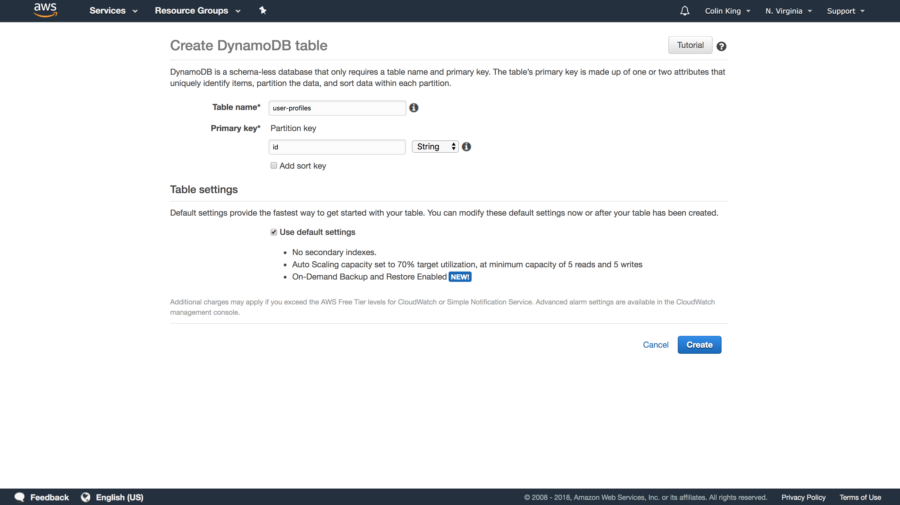

### Lambda

We're going to need a lot of Lambda functions (six!).

But, we'll first need to create an IAM role that we will give to all of these functions. Open IAM and create a new Role. On the `"Choose the service that will use this role"`, select `Lambda`. Add the `CloudWatchLogsFullAccess`, `AmazonDynamoDBFullAccess`, and `AWSXrayWriteOnlyAccess` policies to your new role, too. (This is a bit more permissive than we actually need, but we're keeping things simple.)

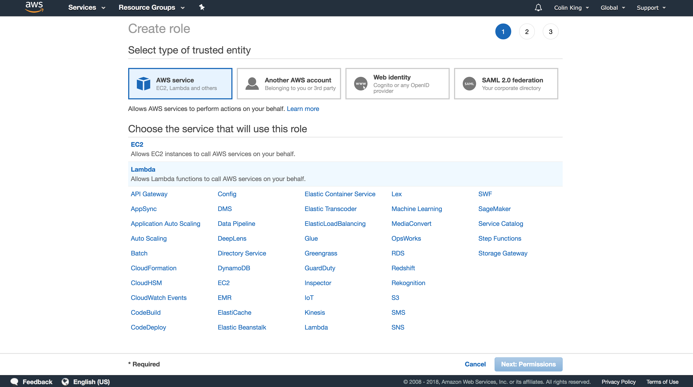

Let's start by creating the Lambda function for the `GET /users` endpoint. Create a new function called `user-profile-get-all` with a Python 3.6 environment and the IAM role you just created.

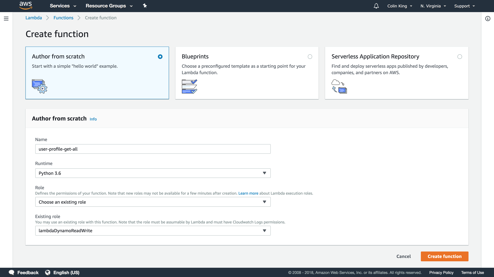

Now, under `"Function code"`, set the `Handler` to `users_handlers.getUsersHandler`. This will instruct Lambda to start execution in the `getUsersHandler` method of `users_handlers.py`. We'll upload the code later.

Under `"Debugging and error handling"`, set `Enable active tracing`. This will enable distributed tracing.

**Make sure to `Save`!**

Great! Now rinse and repeat for each of the other five endpoints:
- `user-profile-post`: `users_handlers.insertUserHandler`
- `user-profile-delete-all`: `users_handlers.deleteUsersHandler`
- `user-profile-get`: `users_handlers.getUserHandler`
- `user-profile-put`: `users_handlers.updateUserHandler`
- `user-profile-delete`: `users_handlers.deleteUserHandler`

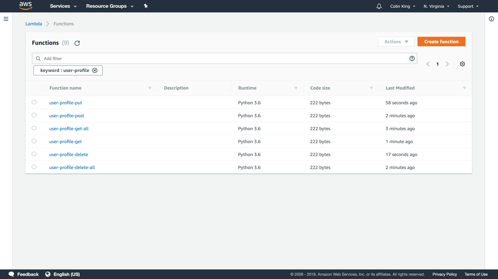

> **Note**: If you think this is a pain, then I'd agree with you! This is one of the reasons why it's worth setting up CloudFormation/Terraform or another infrastructure-as-code tool so that all of this can be automatically created. There are also various tools that make working with serverless less of a pain, like `serverless`, `apex`, or `zappa`, but we don't cover them because we want you to understand how things work!

### API Gateway

Next, we'll create the API Gateway. Go ahead and create a new regional API.

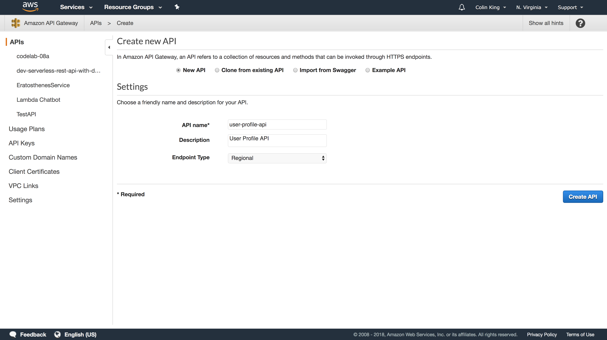

There are 2 resources, plus 3 methods per resource that you'll need to create, corresponding to each of the Lambda functions you just created.

Add a new resource with `Actions > Create Resource`. Create one named `users` for `/users` and another named `{id}` for `/users/{id}`.

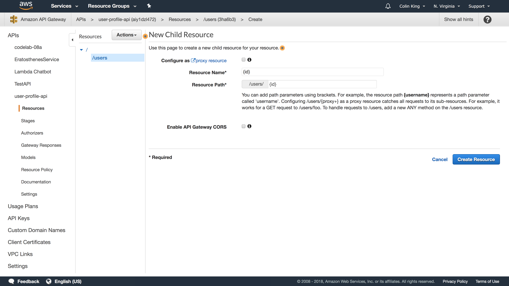

Next, add the methods. To add the `GET /users` endpoint, select `Actions > Create Method` on the `/users` resource. Specify the name of the Lambda function you created (`user-profile-get-all`), and enable `Use Lambda Proxy Integration`. The latter setting will pass a host of metadata to our Lambda function in the `event` object, including path and query parameters.

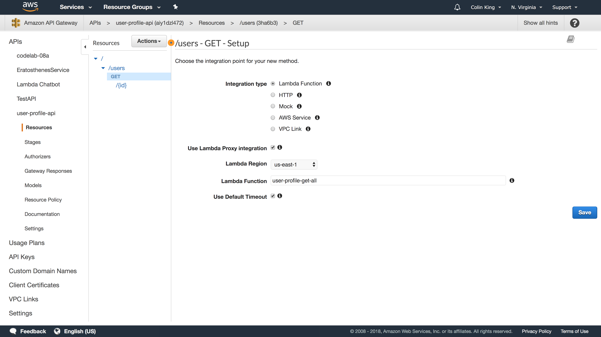

You know what to do: rinse and repeat for the other endpoints:
- `POST /users`: `user-profile-post`
- `DELETE /users`: `user-profile-delete-all`
- `GET /users/:id`: `user-profile-get`
- `PUT /users/:id`: `user-profile-put`
- `DELETE /users/:id`: `user-profile-delete`

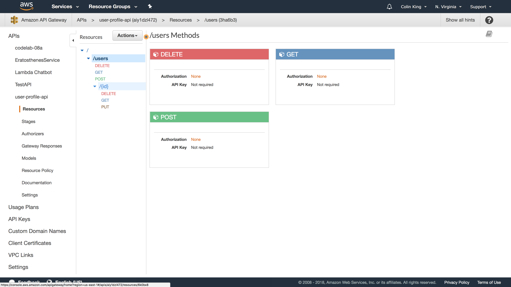

For the `GET /users[?email=:email]` endpoint, we will need to tell API Gateway that we expect the `email` query parameter. This way, API Gateway will pass it on to our Lambda function. Select this method, click on `"Method Request"` (the upper-left box in the request-response diagram), and then add the query string parameter.

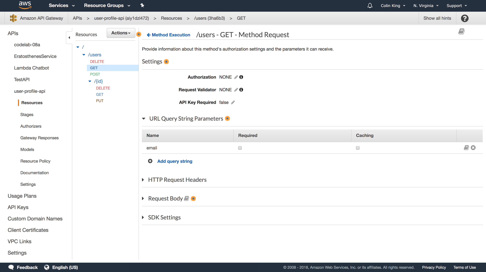

Now that this is done, we just need to deploy our API. Go to `Actions > Deploy API`, create a new stage, and give it a name (like `test`). Once you've created your deployment stage and deployed your API, go enable logging. Open your new stage under the `Stages` tab, then open the `Log` tab and enable CloudWatch logs.

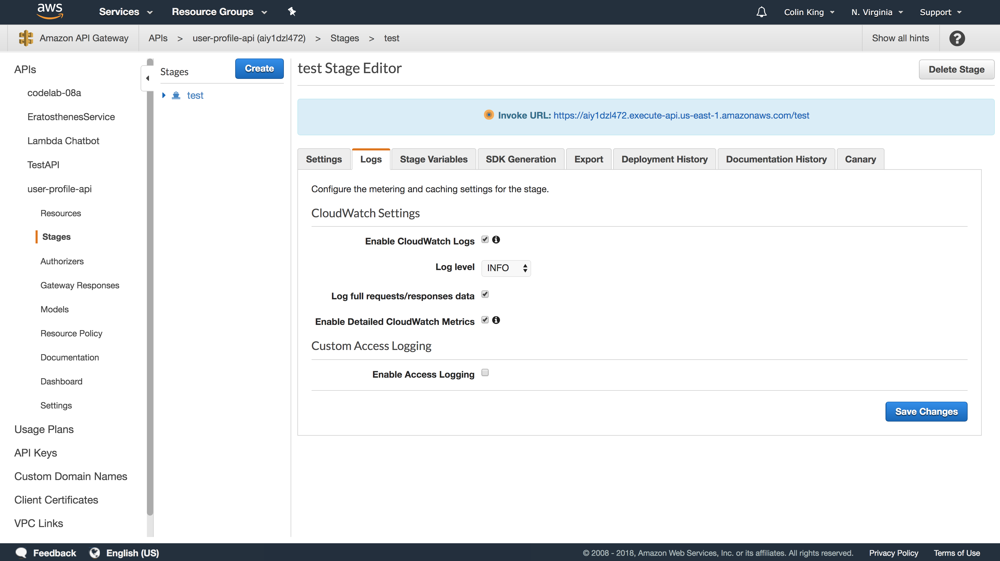

> **Note**: You can use this create multiple deployments for testing/staging/production, such that you can test out a new API without interfering with users who are already using your service.

### Deploy Boilerplate Function Code

You can deploy the boilerplate code provided by running `make deploy`.

This will submit `users_handlers.py` to each of the Lambda functions you created in the prior step.

Whenever you make code changes, you can run this command again to push your updated code.

### Testing

You can run the local tests (which validate that your Lambda handlers work correctly) by running `make test-handlers`.

You can run the end-to-end tests, which validate that your API is fully setup, by running `make test-end-to-end`. Make sure to set `API_ENDPOINT` in `test_e2e.py`, first. You can get this url (the `Invoke URL`) from the `Stages` tab after clicking on your deployment stage.

### Debugging

CloudWatch is setup to record logs for your API deployment and for your individual Lambda functions. You can see both under [CloudWatch](https://console.aws.amazon.com/cloudwatch/home?region=us-east-1#logs:) and looking for the corresponding log group.

You can also see the individual traces with [X-Ray](https://console.aws.amazon.com/xray/home?region=us-east-1#/service-map).

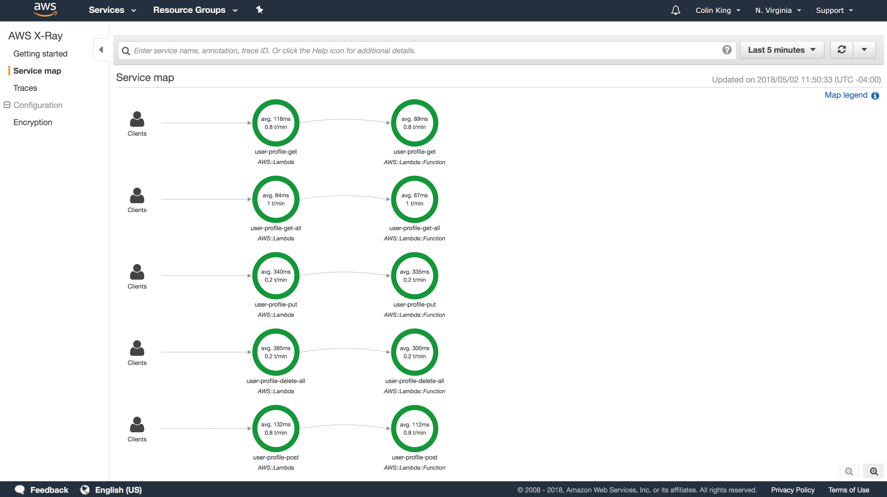

### Assignment

Finish the implementation of the two User Profile API methods in `users_handlers.py`. They're 2-3 lines each. You'll mostly need to consult the boto3 docs on the [DynamoDB resource](http://boto3.readthedocs.io/en/latest/reference/services/dynamodb.html#service-resource) and the [DynamoDB.Table resource](http://boto3.readthedocs.io/en/latest/reference/services/dynamodb.html#table).

Once all tests pass (`make test`), you're good to go.

Submit a file, `api.txt`, to the submit server with your API Gateway endpoint. For example:

```
$ more api.txt
https://foobarblah.execute-api.us-east-1.amazonaws.com/test/
```
