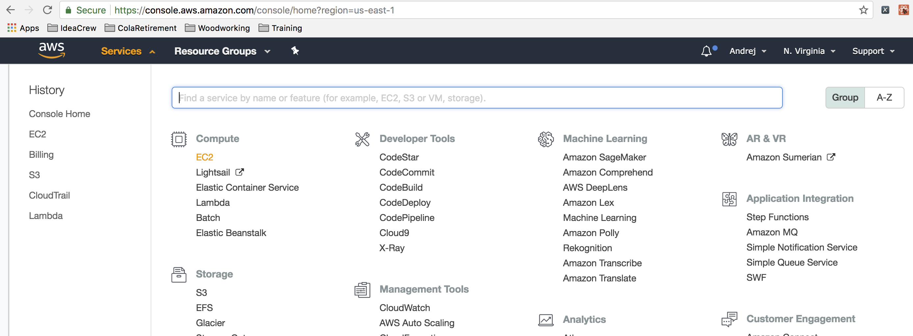
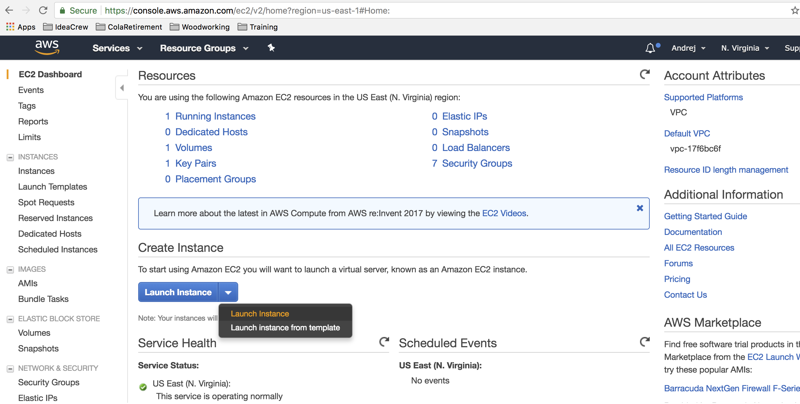
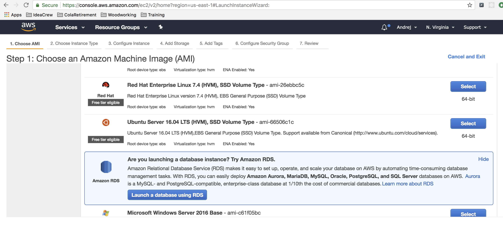
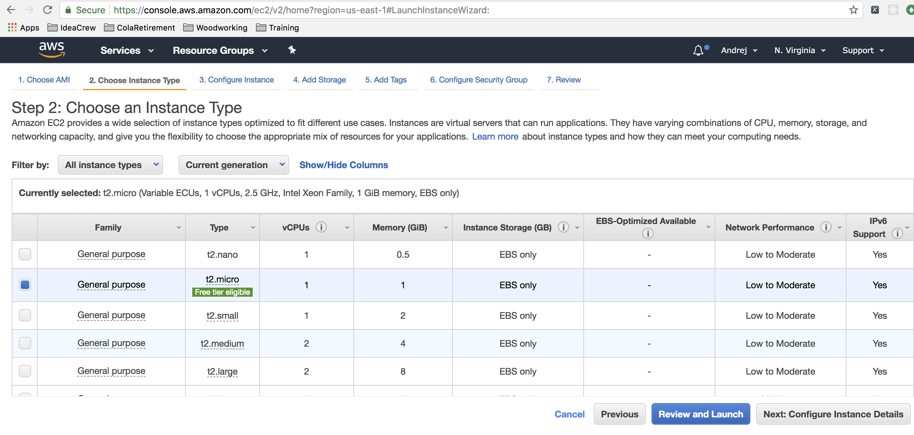
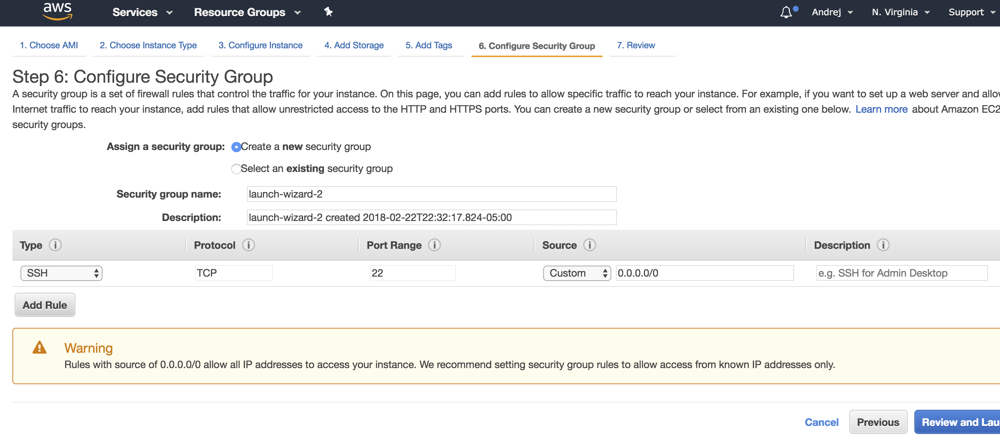
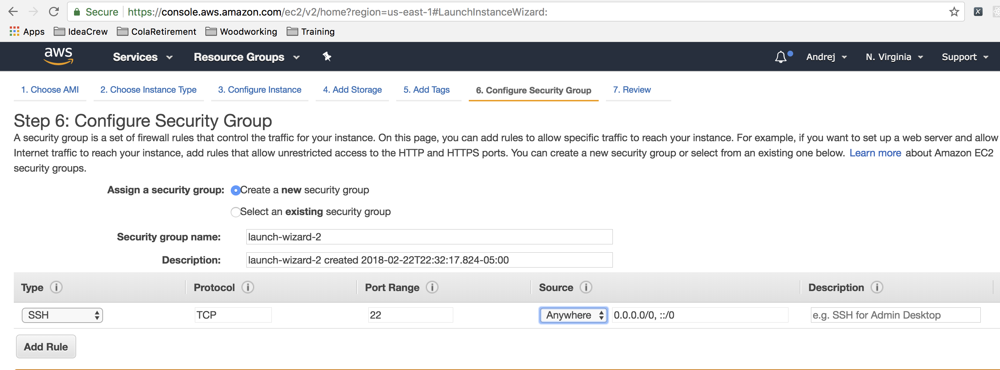
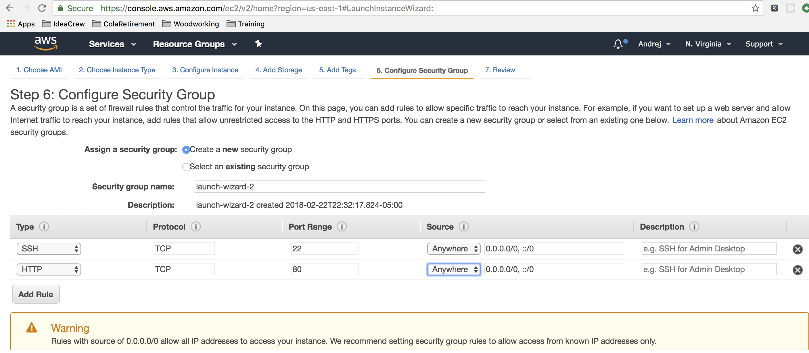
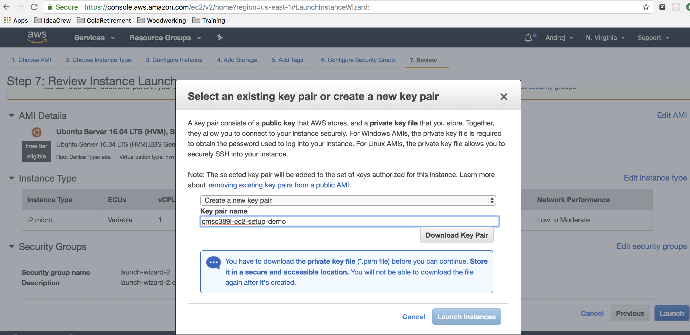
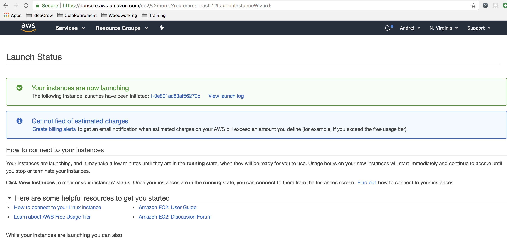

# How-To: Set up an EC2 Instance

In this tutorial we are going to go through all the steps you need to configure
your first Amazon EC2 instance.
First, open up your browser and navigate to the [amazon web services website](https://aws.amazon.com/).
Once there, click on Sign In to the console button on the top right corner.

Once you have logged in successfully, you should see the main page for AWS. You will
now click on the services option on the top menu on the left and from there select EC2
under the compute category.

Now you will select the Launch Instance option from the Launch Instance menu button:

This will launch the wizard that will navigate you through the rest of the process. First you
will need to select the specific AMI (Amazon Machine Image) that you will want to
create. Take a minute to scroll through to see the myriad of options you have to select from.
Once you are done, go back towards the top and select the Ubuntu Server 16.04 LTS image. Take
note of the Free Tier Eligible label beneath the Ubuntu logo. If you launch an instance (or any other resource) that isn't Free Tier Eligible, it will just charge against the free credits you received from AWS Educate.

The next screen you see should prompt you to select the instance type. There is nothing that you need
to do here but you should see a blue box in the second row. This is the machine you are building.

You can either click the button on the bottom right corner that allows you to configure your
instance's details or you can fast-forward and click on the menu option that reads "6. Configure Security
Group". For the sake of this tutorial, do the latter. Once you do that, you should be taken to this screen:

There are several things for you to observe and do here. This is where you will determine which ip
addresses are able to connect to your EC2 instance and by which protocols. First, for the SSH connection,
set it so that any ip address can connect to your EC2 instance. Do this by selecting Anywhere inside the source column.

As you can see above, the default security group only sets up SSH, so if you want to run a web server on your instance then you will need to add a rule to allow HTTP requests. Click Add Rule in the bottom left corner and then select HTTP as the Type. Just as you did in your previous step for the SSH rule, allow anyone
to access your machine via HTTP by selecting Anywhere inside the source column.

Now click "7. Review" on the top menu. This will bring up the dialogue to select which SSH key you will be using
to initially connect to your machine. If you have already created an SSH key, go ahead and use that one. Otherwise, create a new key pair, give it a name, and then download the key. You will use this key to log onto any EC2 instances you create, so keep it safe. (If you lose this key, you can just create a new key and re-launch any EC2 instances you are using.)

Once you have downloaded your key, click on the launch instance button on the bottom right. You should
see this screen in your browser:

Congratulations! You have now successfully launched your first Amazon EC2 instance.

Next up: how to [connect](./ssh.md) to your brand new server via SSH on the command line.
