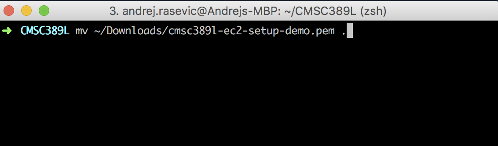
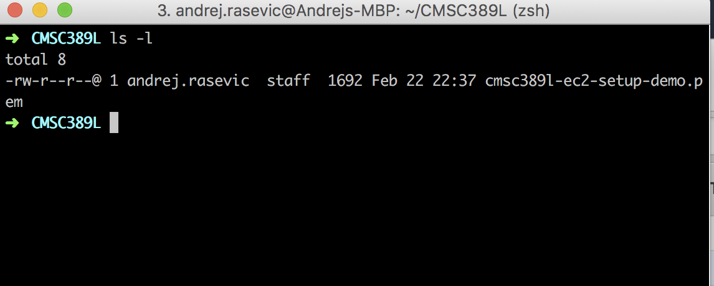
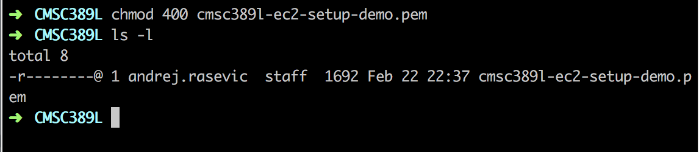
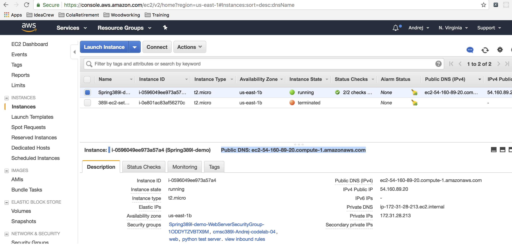
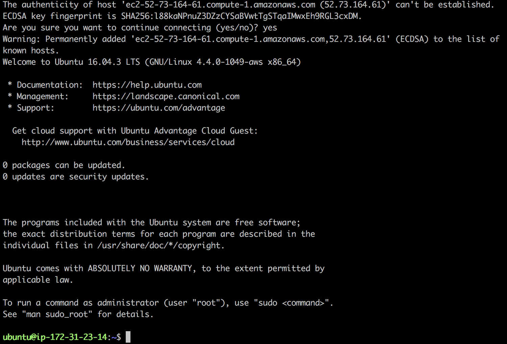

# How-To: SSH onto an EC2 Instance

_**Note**: if you run into any problems with SSH-ing onto your EC2 server, take a look at the common issues section [below](#common-problems)._

For the sake of this tutorial, we are assuming that you already have configured your
EC2 instance, it is up and running and you know where you downloaded the SSH key (`.pem` file)
Amazon generated for you when you first set up your server. If all of these things
are not done, feel free to go back to the [Setting up EC2 instance tutorial](./setup.md) to
take care of any missing details.

This tutorial will take place using the command line. If you haven't already cloned the `389Lspring18` repo, go ahead and do that:

	$ git clone git@github.com:UMD-CS-STICs/389Lspring18.git

Next navigate inside the `keys` directory inside of the cloned repo. Move the key you downloaded from Amazon in the previous tutorial into this directory. The key should be inside of your `Downloads` directory.

Type `ls -l` inside your terminal to view the permissions of this key file.

Remember the permissions you learned about in 216 and
what they referred to? If you don't, click [here](https://chmod-calculator.com/). When you
first download the key, it is set as `rw- r-- r--`. This means that the owner can read and write to the key, but everyone else on your machine can only read it. If you try to connect to your EC2 instance with your key like this (feel free to try!) then you will be denied for security reasons. SSH requires you to limit the permissions such that only the owner can read the key (`r-- --- ---`). Execute the following command: `chmod 400 your-key-name.pem`. After running this command and then running `ls -l` again, you should see this:

Now you're ready to connect to your EC2 instance via SSH!

The final step is to execute the following command:

	$ ssh -i your-ssh-key.pem ubuntu@your-public-dns.compute-1.amazonaws.com

Let's break this command down:
- `ssh -i your-ssh-key.pem`: This provides your private key to SSH, so that it can authenticate your laptop with the server. You can't log onto your server without it! If the key isn't in your current directory, you'll need to provide the path to it (`../keys/your-ssh-key.pem`, etc.).
- `ubuntu@`: This specifies the user account that we want to log in as. We used an Ubuntu AMI, which has a default user account of `ubuntu`. Other OS's will have different default users.
- `your-public-dns.compute-1.amazonaws.com`: This specifies the public DNS (or you can use the public IP) of your EC2 server. It uniquely identifies your server.

To get your public DNS, you can log in to the AWS console, click on EC2 under the services menu as you
did when you first created your server, and then Running Instances (your server must be running or you won't
have anything to connect to).

Click on the server you want to get information about (you should only have one at this point)
and you should see the public DNS in the middle.

This is the public DNS you need to use to connect directly to your machine via SSH (or later on, to
enter in the browser to see a web page you host!).

Go ahead and run the ssh login command. Since this is your first time connecting to this server from your computer, you will
be prompted to verify the authenticity of the host. Go ahead and enter `yes`.

### Congratulations!

You've now successfully connected to your EC2 server for the first time. To logout of your
server, simply type `exit` and you will be back on your local machine.

Anytime you launch an EC2 instance in the future, you just need to run:

	$ ssh -i your-ssh-key.pem ubuntu@your-public-dns.compute-1.amazonaws.com

### Common Problems

There are a handful of issues we have seen before:

**SSH Times Out**

If you try to SSH onto your box, but no prompt appears, then this is likely an issue with the security group.

Go ahead and inspect the security group in the EC2 instance dashboard:

Double-check that port 22 is open to either any IP address (`0.0.0.0/0`) or to your IP address. It's possible that your IP address has changed, so you can double-check what your IP address it by [searching Google for "What's my IP address"](https://www.google.com/search?q=What%27s+my+IP+address).

**Permission Denied**

	$ ssh -i keys/colin-macbook.pem ubuntu@54.90.204.11
	ubuntu@54.90.204.11: Permission denied (publickey).

Are you using the right key pair? You can double-check which key-pair was associated with your EC2 instance here:

Also, double-check that you are using the correct IP address.

This also occurs if you are using the wrong default user. If you are not connecting to an Ubuntu AMI, then you will need to look up what the correct default user is.

**Unprotected Private Key File**

	ssh -i keys/colink-cmsc389l.pem ubuntu@54.90.204.11
	@@@@@@@@@@@@@@@@@@@@@@@@@@@@@@@@@@@@@@@@@@@@@@@@@@@@@@@@@@@
	@         WARNING: UNPROTECTED PRIVATE KEY FILE!          @
	@@@@@@@@@@@@@@@@@@@@@@@@@@@@@@@@@@@@@@@@@@@@@@@@@@@@@@@@@@@
	Permissions 0666 for 'keys/colink-cmsc389l.pem' are too open.
	It is required that your private key files are NOT accessible by others.
	This private key will be ignored.
	Load key "keys/colink-cmsc389l.pem": bad permissions
	ubuntu@54.90.204.11: Permission denied (publickey).

Your key isn't properly `chmod`-ed to `400`. Take a look at the tutorial above.

If that doesn't work, then it might mean that your shell does not have the permissions to modify the permissions of a file. For example, if you are inside of a Vagrant VM and the key is stored in a shared directory, then you have no way of modifying the permissions of files from within Vagrant. A similar problem may exist with the Linux subsystem on Windows 10. If you run into this problem, let us know.

**Something Else**

[Check out AWS's documentation here](https://docs.aws.amazon.com/AWSEC2/latest/UserGuide/TroubleshootingInstancesConnecting.html).
