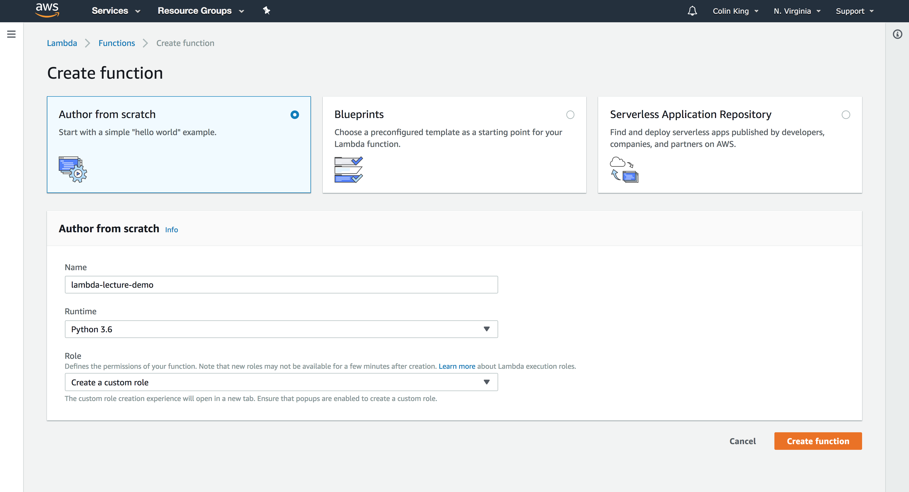

# Lambda Thumbnailer Demo

In this demo, we will take the thumbnailer from the SQS codelab and replace the EC2 instance with a Lambda function to *significantly* reduce the system's complexity.

With this change, we will set up the Lambda function to trigger every time an image is uploaded to the S3 bucket.

Because we are using Lambda, we don't need to worry about load balancing the thumbnail requests with SQS! So we won't need the SQS queue anymore.

### Setup

First, create a new bucket which will be used as the trigger for the Lambda function. Whenever we add a new image to this bucket, a thumbnail will be automatically generated. I created a bucket called `cmsc389l-lambda-demo`.

We will re-use the same S3 bucket for the thumbnails as the previous codelab (`cmsc389l-<USERNAME>-codelab-05-thumbnails`). Run the setup script from the previous codelab if you need to re-create this bucket (`python setup.py --buckets`).

### Lambda

#### Creating a Lambda Function

Create a new Python 3.6 Lambda function.



But first, we'll need to create a custom IAM role for this function so that it can access S3. When you set Role to `Create a custom role` it will redirect you to the following page. Go ahead and create it the role, then return to the function setup page and create the function.


This IAM role only has CloudWatch Logs access, which is where it will store the logs every time it executes a Lambda function. We need to add an IAM policy for S3 access.

Add S3 access for the IAM role by navigating to IAM in the Management Console, opening the role you just created, and attaching a policy named `AmazonS3FullAccess`.


Now, let's test out the new Lambda function we just created.

#### Testing Lambda Functions

First, configure a new test event using the dropdown in the top-right. Go ahead and add a simple example event and then run it by clicking `"Test"`.


As you can see, it executed this function in only `2.33ms` (!). We can view the logs that were written to CloudWatch by clicking the `logs` button. You'll see the log messages under the most recent log stream. If you test the function a few more teams, you'll see the logs show up pretty quickly.

You can already see the value of lambda -- remember all that complex configuration you went through to launch an EC2 instance just to run a small amount of code? And remember how you had to SSH onto the server to access the `cloud-init.log` file for the SQS codelab? You wouldn't have to think about log aggregation anymore, instead it is all aggregated for you into CloudWatch automatically.

Instead of just manually triggering this Lambda function, let's set it up to execute every time an object is updated in the `cmsc389l-lambda-demo` S3 bucket.

#### Triggering Lambda with S3

Open up the `Designer` tab and add an S3 trigger. We can configure it below under the `Configure triggers` tab. Set the bucket name and then add a filter pattern for `.jpg` files, so that it will only trigger when a JPG image is uploaded into this bucket. Go ahead and add then save it.


We can now test this by uploading a `.jpg` file to that bucket. Go ahead and open the logs for this function to see what the last log line is. Then, upload the image. You could use the Management Console or your terminal. If on the terminal, you could use the `s3 cp` command like so:

```
$ aws s3 cp ~/Downloads/canyon.jpg s3://cmsc389l-lambda-demo/canyon-100x100.jpg
```

Reload the logs and you should see a few new lines indicating that the Lambda function was executed!

Now, all of the metadata about the event that triggered the Lambda function is stored in the `event` parameter that is passed to our handler function. Let's edit the function to print out this event so that we can take a look at it.

> **Note**: Make sure to click the orange "Save" button every time you edit, otherwise it won't deploy your updated code.


Now, upload a new file to the bucket and check the logs. You should see a JSON blob that contains the S3 update message.

> **Note**: Logs are grouped by time in "log streams". Always look at the most recent log stream.


Here's what that looks like, pretty-ified:

```
{
  'Records': [
    {
      'eventVersion': '2.0',
      'eventSource': 'aws:s3',
      'awsRegion': 'us-east-1',
      'eventTime': '2018-04-01T12:48:32.703Z',
      'eventName': 'ObjectCreated:Put',
      'userIdentity': {
        'principalId': 'AWS:AIDAIJAVH3GANZQ5KZVRU'
      },
      'requestParameters': {
        'sourceIPAddress': '75.102.137.174'
      },
      'responseElements': {
        'x-amz-request-id': '2D4F008FCD69C929',
        'x-amz-id-2': 'lXPWPPXYG5eUMYtl9wkecOgi1bVn3Vecxz7oSPd7GgEXj5/L36DFm7VHHiJMdkdMnwUEf8V4A7g='
      },
      's3': {
        's3SchemaVersion': '1.0',
        'configurationId': '48492e46-58e0-4753-b76b-ab36570bda96',
        'bucket': {
          'name': 'cmsc389l-lambda-demo',
          'ownerIdentity': {
            'principalId': 'A176D9GMS6B5YI'
          },
          'arn': 'arn:aws:s3:::cmsc389l-lambda-demo'
        },
        'object': {
          'key': 'canyon-100x100.jpg',
          'size': 1204498,
          'eTag': 'fd88e3eba5baa463f456708277b1cef7',
          'sequencer': '005AC0D5205ED30951'
        }
      }
    }
  ]
}
```

So, using this `event` object, we can tell which bucket and key were updated.

Great, all that is left now is to update the Lambda function to perform our thumbnailing on this image!

#### Lambda Thumbnailer Code

We will need three files from the previous codelab: `config.py`, `image.py`, and `utils.py`. However, I've made a few changes to `image.py` since we no longer use SQS. You can go ahead and download the updated code [from Piazza here](https://piazza.com/class_profile/get_resource/jcsfmcmvvp46ju/jfjp8jmpvtx9g).

With the simple "Hello World" Lambda function, we could edit it inline in the Lambda editor. However, our Lambda function will need access to the Python Image Library (PIL aka `pillow`) pip package. Therefore, we must create a deployment package that contains not just our code, but the pip package, too.

> **Note**: Some packages perform compilation steps when they are installed and are therefore OS-dependent. This is a problem because it's unlikely you are currently developing on an Amazon Linux box, which would match the OS where the Lambda function will eventually run! This is an easy fix, though. We can run a Docker container that is running Amazon Linux, and then install the pip package within that container. We will use the [`myrmex/lambda-packager`](https://github.com/myrmex-org/docker-lambda-packager) container which contains all of this logic for us. The `install-pip-packages` command in the Makefile will run this for you.

> **Note**: You will need to install Docker if you haven't already. It's available here: https://www.docker.com/community-edition#download

The dependency we need, `pillow`, is already included in `requirements.txt`. If you run `make install-pip-packages`, it will install and compile all of the requirements for us.

Now, run `make compress` and it will generate our deployment package for us by creating a `.zip` file that contains the contents of the `deployment` directory.

Great, everything is now ready! Let's deploy this deployment package.

#### Deploying your Lambda Function

Return to Lambda in the Management Console and upload `deployment_package.zip`. Make sure to change the handler function from `lambda_function.lambda_handler` to `image.main`. Click `Save` and your Lambda function will be updated with the new codebase.


You'll also need to increase the memory limit from `128MB` to `512MB` and increase the timeout to `10s`. You can adjust these under the `Basic Settings` tab.

Let's now test this Lambda function! Go ahead and upload a new image into the Lambda bucket you configured the function to listen to:

> **Note**: Since we no longer are using SQS messages, the new width/height of a thumbnail is now expressed in the file name. Make sure to set the key accordingly, like below!

```
$ aws s3 cp ~/Downloads/canyon.jpg s3://cmsc389l-lambda-demo/canyon-400x400.jpg
```

If the thumbnail shows up in the bucket, and you see the logs in CloudWatch, then it worked!

If you want, you can create a test event using the event that we printed out earlier. This will allow you to test your Lambda function in the Management Console! This allows you to quickly test and debug your function.


Go ahead and try it with a few different sizes and watch how long it takes for the Lambda function to generate the image. It's quick! We can quantify exactly how fast it is, using `AWS X-Ray` to enable distributed tracing.

#### Handling Lambda Complexity

First, we need to enable `Active Tracing` on our Lambda function so that X-Ray will run its distributed tracing middleware. You can find this as a checkbox under the `Debugging and error handling` tab.


> **Note**: This setting was buggy for me. The first time you save your function after enabling active tracing, it will add the required policies to your IAM role, but won't enable active tracing. Just click the checkbox again and save again. The second time, it should not show you the same red prompt. ¯\\_(ツ)_/¯

Now that is set up, go ahead and execute a few thumbnailing requests on the terminal.

After a few seconds, the traces for those requests will show up in the `AWS X-Ray` section of the Management Console.


As you can see, from the moment the S3 event was created, it took less than 2s to generate the new thumbnail, end-to-end!

If you go to the `Service Map` tab, you can also see that X-Ray has mapped out all of your Lambda functions, along with the average time per request and the number of transactions per minute (t/min) that they see. For this Lambda function, it breaks it into the latency to boot the function (the first green circle) and the time taken to evaluate the function (the second green circle).


If the Lambda function fails for any reason, you'll see this reflected in this service map. This service map can be key for breaking down the complexity of a FaaS system because it will display all of the inter-connected relationships, and allow you to reason about errors by tracing back to see exactly how a failure occurred.


